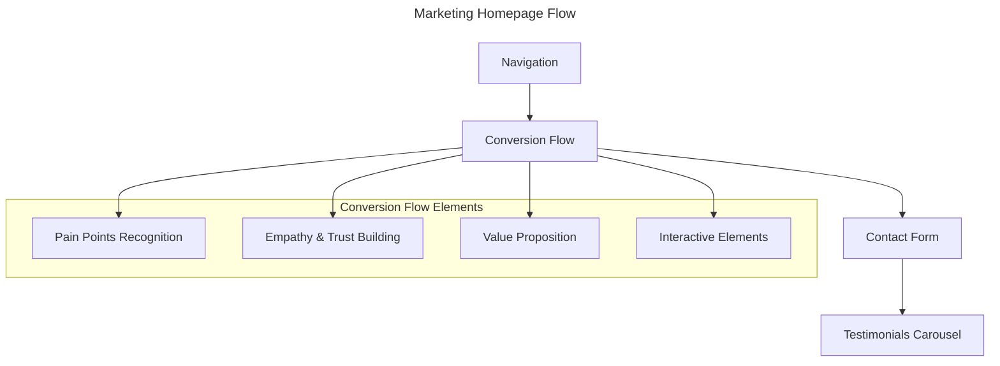

# Epic: Marketing Homepage

## Epic Information
- **Epic ID:** EPIC-MARKETING-HOMEPAGE
- **Status:** Draft
- **Priority:** High
- **Estimated Effort:** Large

## Epic Description
This epic focuses on creating an engaging, conversion-oriented marketing homepage with animated elements that guide visitors through a compelling narrative about small business marketing services. The homepage will feature a modern, responsive design with interactive animations that enhance the user experience and drive conversions. The design will follow a minimalist black/white aesthetic with gold (fde047) and blue (448ade) accent colors.

## Business Value
The marketing homepage will serve as the primary entry point for potential clients seeking marketing services. By implementing an engaging, animated flow that addresses pain points and presents solutions, we aim to increase lead generation and conversion rates for marketing services.

## User Impact
Small business owners visiting the site will experience a narrative that acknowledges their challenges, builds trust, and presents clear value propositions, ultimately guiding them toward taking action.

## Technical Approach

## Design Guidelines
- **Color Palette:** Minimalist black/white with gold (fde047) and blue (448ade) accents
- **Typography:** Sans-serif font used site-wide
- **Navigation:** Blue (448ade) for links, gold (fde047) for active/hover states
- **Animations:** Eye-catching animations in the conversion flow
- **Logo:** Company star logo in the navbar
- **Future Consideration:** Star motif may be incorporated in later iterations

## Dependencies
- Finalized brand assets and style guide
- Animation library (Framer Motion as specified in architecture)
- Component library setup
- Responsive design system

## Acceptance Criteria
1. Homepage implements all specified sections and animations
2. Design is responsive across all device sizes
3. Animations are smooth and enhance the user experience
4. Page load time is under 3 seconds
5. All interactive elements are accessible
6. Navigation is intuitive and consistent with site architecture
7. Analytics tracking is implemented for all interactive elements
8. Color scheme adheres to the specified black/white/gold/blue palette

## Stories

### Story 1: Navigation Structure
Create a responsive navbar with links to Home, Services, Testimonials, and About sections that provides intuitive site navigation across all device sizes.

### Story 2: Conversion Flow
Implement the main marketing flow that guides visitors through a narrative journey from pain point recognition to solution presentation, with animated elements that enhance engagement and drive conversion.

### Story 3: Contact Form
Create an effective call-to-action section with contact form that encourages visitors to reach out for services, featuring the signature and personal touch from Curtis Mortensen.

### Story 4: Testimonials Carousel
Implement an interactive testimonials carousel that showcases client feedback with rotating cards featuring client logos, photos, and reviews to build trust and credibility.

## Risks and Mitigations
- **Risk:** Animation performance on lower-end devices
  - **Mitigation:** Implement performance monitoring and fallbacks for devices that can't handle animations
  
- **Risk:** Accessibility concerns with animated content
  - **Mitigation:** Ensure all animations respect user preferences (prefers-reduced-motion) and provide alternative content

- **Risk:** Page load performance with animation libraries
  - **Mitigation:** Implement code splitting and lazy loading for animation components

- **Risk:** Missing client photos or logos for testimonials
  - **Mitigation:** Implement fallback default images and ensure the design works well with placeholder content

## Timeline
- Estimated completion: 3-4 weeks
- Critical path: Stories 2, 3 (Conversion Flow, Contact Form) 